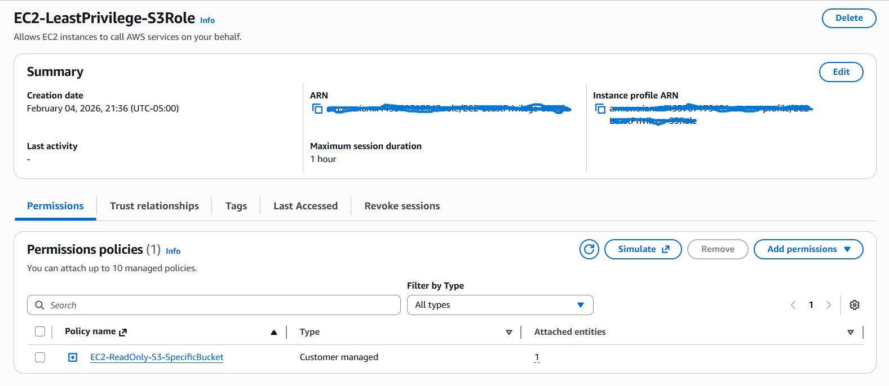

# AWS IAM Least Privilege Role + CloudTrail Audit Logging

## Goal
Implement a least-privilege IAM role for an EC2 service and enable CloudTrail to audit IAM activity.

## What I Configured
- Created an EC2 IAM role: `EC2-LeastPrivilege-S3Role`
- Attached a customer-managed policy scoped to a specific S3 bucket (least privilege)
- Enabled a multi-region CloudTrail trail: `Security-Audit-Trail`
- Enabled log file validation and SSE-KMS encryption for audit integrity
- Verified logging by reviewing IAM events in CloudTrail Event History

## Why This Matters
- Least privilege reduces blast radius if a service or credential is compromised
- CloudTrail provides visibility for auditing and incident response
- Log validation + KMS encryption improves integrity and confidentiality of audit logs

## Evidence

- IAM least-privilege role attached to EC2  
  

- CloudTrail secure configuration (multi-region, KMS, validation)  
  

- IAM activity captured in CloudTrail event history  
  

## Files
- IAM policy JSON: `/policies/s3-readonly-specific-bucket.json`

## Interview Talking Points
- Users vs Roles: users for humans, roles for services (temporary creds)
- Least privilege: grant only required actions on specific resources
- CloudTrail: who did what, when, and from where; verify by filtering IAM events
